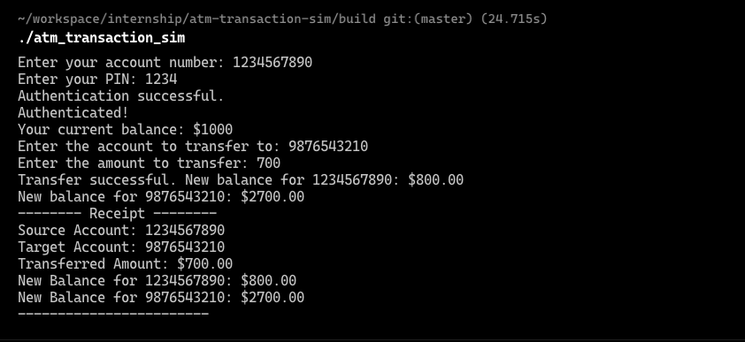

# ATM Transaction Simulator in C

Welcome to the ATM Transaction Simulator project! This repository showcases a comprehensive embedded systems simulation of an ATM's transaction process using the C programming language. The simulator covers user authentication, balance inquiries, fund transfers, and receipt generation, while also incorporating error handling and security measures.

## Project Highlights

- **Secure User Authentication:** Implement a robust authentication mechanism for users.
- **Accurate Balance Inquiries:** Fetch and display account balances accurately for simulated users.
- **Seamless Fund Transfers:** Enable smooth fund transfers between accounts with data integrity checks.
- **Transaction Receipt Generation:** Generate detailed receipts for successful transactions.
- **Modular and Organized Structure:** Divide the project into well-structured components for readability and maintenance.

## How to Use

1. Clone this repository to your local machine using `git clone https://github.com/theghostmac/atm-transaction-sim.git`.
2. Navigate to the project directory: `cd atm-transaction-sim`.
3. Compile the C code:
```shell
mkdir build
cd build
cmake ..
make
```
4. Run the simulator: `./atm_transaction_sim`
5. Available accounts:
   - account number: 1234567890, pin: 1234
   - account number: 9876543210, pin: 4321


Follow the on-screen prompts to experience the ATM transaction process and interact with the simulation.

## Project Structure

The project is structured as follows:

- `main.c`: Main program that integrates different modules.
- `authentication.c`: Handles user authentication.
- `balance.c`: Manages balance inquiries.
- `transfer.c`: Facilitates fund transfers between accounts.
- `receipt.c`: Generates transaction receipts.

## Contact

If you have any questions or would like to discuss how this project aligns with your requirements, please feel free to contact me at [your@email.com](mailto:your@email.com).

Thank you for checking out the ATM Transaction Simulator project!


